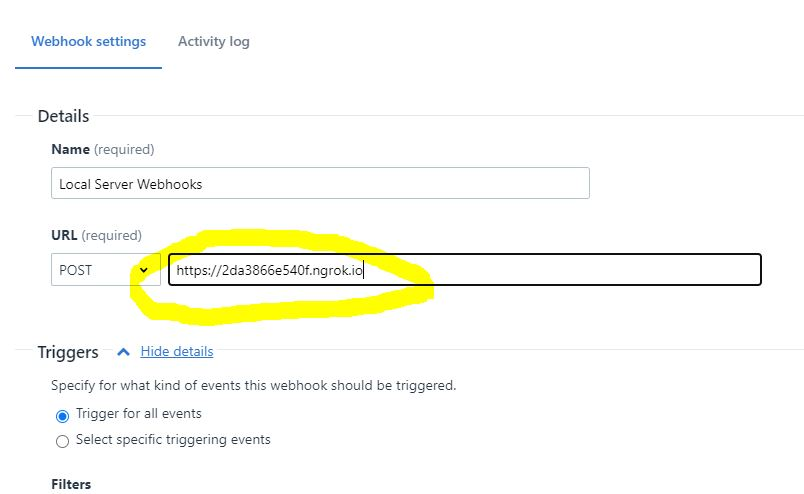
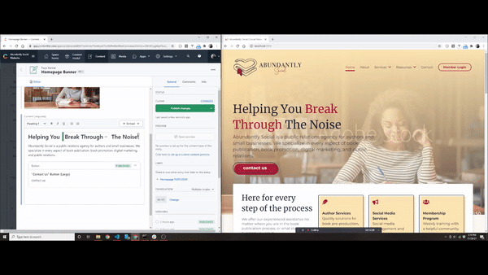

# Live Updates on Localhost with Contentful Hugo and Ngrok

This guide will explain how to setup a local environment that can recieve live updates from Contentful. To achieve this we use contentful-hugo's built in server along with [concurrently](https://npm.com/concurrently), and [Ngrok](https://ngrok.com).

Concurrently is an npm package that allows you to run multiple commands at the same time, while Ngrok is a service that enables you to easily expose a local server to the internet.

## 1) Add concurrently to your project

```
npm i --save concurrently
```

## 2) Update your package.json scripts

Add a new script that runs `contentful-hugo --preview --server` and `hugo server` simultaneously using concurrently.

```json
{
    "scripts": {
        "dev": "concurrently \"contentful-hugo --preview --server\" \"hugo server\""
    }
}
```

_**Sidenote**: if you have heavily nested content you may need to run `hugo server --disableFastRender` instead of `hugo server` to ensure that everything get's rerendered properly on change._

## 3) Run your new script

```bash
npm run dev
```

After this you will have hugo server running on port `1313` and the contentful-hugo server running on port `1414` on your local machine. Now all that's left to do is expose the local webserver to the internet. We will accomplish this with [Ngrok](https://ngrok.com)

## 4) Install Ngrok on your machine

Open a separate terminal window and run

```bash
npm i -g ngrok
```

Or download it from the [Ngrok website](https://ngrok.com) (If you download it you will need to run the Ngrok commands in the directory where it get's extracted to)

After doing this you should have access to the `ngrok` command.

## 5) (Optional) Create an Ngrok account and add your auth token.

This is an optional step but it will give you access to more features and longer session times.

-   Go to https://ngrok.com and create a free account.
-   Navigate to "getting started" -> "setup & installation"
-   find your auth token
-   type the following command in your terminal

    ```bash
    ngrok authtoken <your-token-goes-here>
    ```

## 6) Run Ngrok for Port 1414

```bash
ngrok http 1414
```

This command will expose port 1414 on your local machine to a web address, and bring up an ngrok terminal interface.


## 7) Create a Contentful Webhook

Copy the forwarding address listed in the Ngrok terminal interface and paste it into the `URL` field. Bear in mind this forwarding address changes every time you fire up Ngrok so you'll need to swap it out each time.



You can set Triggers to "trigger for all events" and make sure the URL field is set to "POST"

## That's it!

Now you have live updates on your local machine whenever anything changes in Contentful.


